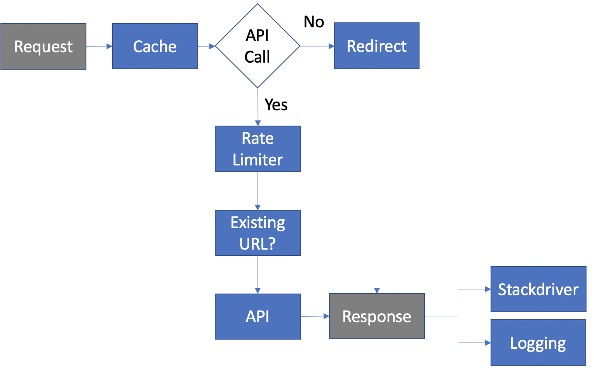

<h1><b>O</b>ne <b>C</b>lick <b>U</b>RL</h1>
<p align="center">
  
</P>

Check it out at ocurl.io

> OCUrl: URL shortening service API

<p align="center">
  Extensions: 
  <a href="https://github.com/nigel5/ocurl-discord" target="_blank" rel="noopener noreferrer">Discord Bot</a> | <a href="https://chrome.google.com/webstore/detail/1-click-url/obmdcjlmgabdmcoiconimmddlfldpjni?hl=en-GB&authuser=0" target="_blank" rel="noopener noreferrer">Chrome Extension</a>
</P>

## Features

- Public REST API for developers
- Cached (still works if cache is offline!)
- Unobtrusive one click Chrome extension to shorten current page URLs and copy to clipboad
- Simple configuration and deployment. Docker 🐋 ready.
- Easy configuration
- Google Cloud Operations ready

<p align="center">
  
</P>

## Public API

There are only two types of responses: data (200) and error response (5xx).

A data response is the following structure

```json
{
  "data": [Object]
}
```

An error response is the following structure

```json
{
  "error": [Object],
  "message": string
}
```

| Method | Endpoint       | Query parameters?                                                           | Description                               |
| ------ | -------------- | --------------------------------------------------------------------------- | ----------------------------------------- |
| GET    | /api/v1/url    | `q` {string} A valid destination url. `l` {number} Length of short url path | Get a short url for destination `q`       |
| GET    | /api/v1/decode | `q` {string} The short url                                                  | Get destination for short url or key `q`. |
| ANY    | /api/v1/health | none                                                                        | Server health [ok 200,unavailable 500]    |

### Example

```javascript
fetch('https://onecurl.com/api/v1/url?q=https://github.com')
  .then((res) => res.json())
  .then((json) => console.log(json));

// Output:
// {
//   "data": {
//     "url": "localhost:3000/ou6p1"
//   }
// }
```

## Requirements

- Node.js v12.18.3 LTS
- Redis 6
- PostgreSQL

## Docker Setup

The easiest way to setup the application is by using Docker.

To run in Docker,

> docker-compose up --build

This will pull `node:14`, `redis:latest`, and `postgres:latest`.

## Local Development Setup

First, start up Postgres, and optionally, Redis if you want a cache. Modify the dev configuration file with the hostname and ports if required. Then,

```javascript
yarn install
yarn dev // Nodemon will watch for changes and automatically restart the server
```

## Configuration

Global application settings are exported in `main.js`. Ocurl provides configuration files for development, producation, and docker by default.

## Stackdriver Logging

To enable Google Cloud Platform Operations Logging (formerly known as Stackdriver), export the path to the credentials file.

> EXPORT GOOGLE_APPLICATION_CREDENTIALS="thePath"

Or create a `.env` file in the root of this project with this variable.

## License

**MIT**
